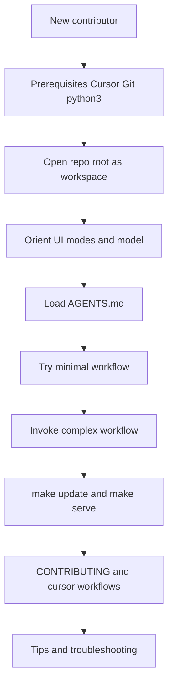

# Getting started with Cursor

Use the following sections if you are new to Cursor or to agent-style workflows in an editor. The page explains basic ideas first, then concrete steps to open the repository and try a small task and then a more complex task.

**Claude Code and parity:** The plugins in the repository also target **Claude Code**, a separate product. If you only use Cursor, you can treat Claude Code as background until you need the detail in [Cursor workflows](cursor-workflows.md) (skills, commands, and parity with Claude Code).

## Start here

Use the following checklist as a fast path; the sections below explain each step.

1. Install Cursor, Git, and `python3` for the docs build. See [Prerequisites](#prerequisites).
1. Clone the repository and open the **repository root** folder in Cursor. See [Open the repository as the workspace](#open-the-repository-as-the-workspace).
1. Open the **Agent** panel, pick a **mode** and **model**, then type a message. See [Orient yourself in the UI](#orient-yourself-in-the-ui).
1. Attach **`AGENTS.md`** before you ask for substantive edits. See [Load project instructions](#load-project-instructions).
1. Try a [minimal workflow](#try-a-minimal-workflow), optionally [invoke a more complex workflow](#invoke-a-more-complex-workflow), then [preview the documentation site](#preview-the-documentation-site) and review [Next steps for contributors](#next-steps-for-contributors).

A [Suggested path](#suggested-path-for-a-new-contributor) diagram at the end of the page summarizes the same flow.

## Terms you will see

The following terms appear often in Cursor and in the repository documentation.

1. **Workspace** — The folder Cursor has open as the project. In the following instructions, the workspace should be the **repository root** (the clone folder that contains `AGENTS.md` and `plugins/`).
1. **`plugin:skill`** — The fully qualified name of a skill (for example `docs-tools:jira-reader`). The repository requires that form everywhere; see [Skills and fully qualified names](#skills-and-fully-qualified-names).
1. **`@` mention** — Typing `@` in the chat or Agent input to attach a file or symbol to the message so the model includes it in context.
1. **Agent panel** — The Cursor UI area for chat and Agent tasks (shortcut **Cmd+I** / **Ctrl+I**). An **agent file** under `plugins/<plugin>/agents/` is unrelated Markdown (a persona); do not confuse the two.
1. **Frontier model** — The AI model selected for a request (for example from the model dropdown). **Context window** is how much text the model can consider at once; **Max Mode** uses a larger window when your plan allows it.
1. **Claude Code** — A separate assistant product that uses the same plugin Markdown. You do not install it inside Cursor; see [Cursor workflows](cursor-workflows.md) for how the files map.

## What Cursor is

Cursor is a code editor based on VS Code with integrated AI assistance. If you know VS Code, you will already feel comfortable in the Cursor UI. If you have never used VS Code, treat Cursor like any desktop editor with a file tree on the side, tabs for open files, and a **Terminal** menu for a built-in shell. Use **File** → **Open Folder** (or your operating system equivalent) to open the clone folder `redhat-docs-agent-tools/`. The **Agent** side panel is separate from the file tree; open it when you want AI help.

Using Cursor, you can select different modes (`Ask`, `Debug`, `Plan`, `Agent`) and also choose the model you want to use to provide assistance (including different `claude` and `gpt` models).

In the Red Hat Docs Agent Tools repository, you use Cursor to read and edit skills, commands, and agents under `plugins/`. These items are formatted as plain Markdown. You can also preview the Red Hat Docs Agent Tools documentation site locally with `make serve`.

The Red Hat Docs Agent Tools repository also includes [AGENTS.md](https://github.com/redhat-documentation/redhat-docs-agent-tools/blob/main/AGENTS.md) and [`.cursor/rules/`](https://github.com/redhat-documentation/redhat-docs-agent-tools/tree/main/.cursor/rules), which enables the Cursor assistant to follow the same conventions as [CLAUDE.md](https://github.com/redhat-documentation/redhat-docs-agent-tools/blob/main/CLAUDE.md) for collaborators who use Claude Code elsewhere.

## What agentic workflows mean here

An **agentic** workflow means the model can work across multiple steps and files using a project's context (open files, repository layout, and rules) and is not restricted to answering a single isolated question as with most generic chat LLMs like Gemini or ChatGPT.

In practice, you provide a goal in a prompt. The assistant might then read files, propose edits, and run terminal commands where allowed. For security purposes, the assistant will often prompt you for permission before carrying out actions.

The project rules in AGENTS.md and `.cursor/rules/` act as guardrails so changes stay aligned with repository naming, script paths, contribution expectations, and other restrictions.

## How the repository uses AI context

Skills are Markdown knowledge under `plugins/<plugin>/skills/`. Rules and AGENTS.md tell the assistant how to reference skills, run scripts, and match plugin metadata.

Note that no Claude Code marketplace equivalent exists inside Cursor. You work with the tree on disk. For other limits compared to Claude Code (slash commands, eval runner, and so on), see [Parity limits](cursor-workflows.md#parity-limits) on the Cursor workflows page.

## Skills and fully qualified names

Always reference **skills** with the fully qualified form `plugin:skill` (for example, `docs-tools:jira-reader`, not `jira-reader` alone). The same rule applies in agent instructions, cross-references, and inline text. See [AGENTS.md](https://github.com/redhat-documentation/redhat-docs-agent-tools/blob/main/AGENTS.md) for the full convention and examples.

## Privacy and responsibility

Do not paste secrets, credentials, or customer-only content into the chat. Follow your team and organizational policies for AI-assisted editing. For how Cursor handles data and privacy, see the [Cursor documentation](https://cursor.com/docs).

## Prerequisites

1. You have installed Cursor.
1. You have installed Git and it has access to GitHub (fork or clone permissions as required by your organization).
1. You have installed `python3` so that you can run `make update` and the Zensical docs build (see [README.md](https://github.com/redhat-documentation/redhat-docs-agent-tools/blob/main/README.md)).

## Open the repository as the workspace

1. Clone the upstream repository or your fork. For the upstream copy:

   ```bash
   git clone https://github.com/redhat-documentation/redhat-docs-agent-tools.git
   ```

   Use your fork URL instead if you contribute through a fork (for example `https://github.com/<your-username>/redhat-docs-agent-tools.git`).

1. In Cursor, use **File** → **Open Folder** (or your operating system equivalent) and select the **repository root**, not a parent directory that only contains the repo. After the clone command above, that folder is `redhat-docs-agent-tools/`. The workspace root is the folder that contains **`Makefile`**, **`AGENTS.md`**, and **`plugins/`** in one place.

Paths in [AGENTS.md](https://github.com/redhat-documentation/redhat-docs-agent-tools/blob/main/AGENTS.md) and in scripts assume the workspace root matches the repository root.

**Integrated terminal:** To run `git`, `make`, or `python3` commands later, open **Terminal** → **New Terminal** (or the command palette shortcut your build uses). If the shell opens in another directory, run `cd` into `redhat-docs-agent-tools` and confirm with `pwd` (Linux or macOS) or `cd` with no arguments (Windows PowerShell: `Get-Location`) that the current directory lists `Makefile` when you run `ls` or `dir`.

## Orient yourself in the UI

**If you only remember one thing:** Use **Ask** to explore **without** edits; use **Agent** for normal edits and commands; use **Plan** when you want a written plan before large changes; use **Debug** only for **runtime** bugs (scripts, tests), not for ordinary Markdown edits.

Cursor exposes the coding assistant in the **Agent** side panel (common shortcut **Cmd+I** on macOS and **Ctrl+I** on Windows and Linux). Open that panel first, then choose **how** the assistant should behave (**mode**) and **which model** should answer (**model**), then type your message.

**Switch modes:** Use **Shift+Tab** to cycle modes, or open the **mode** control in the input area (labels vary by version). Official overviews: [Ask mode](https://cursor.com/help/ai-features/ask-mode), [Plan Mode](https://cursor.com/docs/agent/modes), [Cursor Agent](https://cursor.com/docs/agent/overview), [Debug Mode](https://cursor.com/docs/agent/debug-mode).

**Ask**

Ask mode is **read-only**. The assistant answers questions and explores files **without** applying edits. Use it to learn where skills live, what a command file contains, or how two paths relate. When you are ready to change files, switch to **Agent** (or **Plan** first for large work).

**Plan**

Plan mode produces a **written plan** before the assistant applies broad changes. The assistant can research the workspace, ask clarifying questions, and output a plan you can review or edit. Use it for ambiguous scope, many files, or architectural choices. Plans save under your home directory by default; you can move a plan into the workspace for sharing. For quick, familiar edits, **Agent** mode alone is often enough.

**Agent**

Agent mode is the usual **do the work** mode: the assistant can edit files, run terminal commands, and use tools (search, rules, and more). Use it for everyday contribution tasks in the repository (Markdown edits, `make update`, pull-request prep). The [Cursor Agent](https://cursor.com/docs/agent/overview) overview describes tools, checkpoints, and related behavior.

**Debug**

Debug mode targets **bugs that need runtime evidence**. The assistant forms hypotheses, may add instrumentation, asks you to **reproduce** the problem, reads logs, then applies a focused fix. Use it when something **fails at run time** (for example scripts, tests, or local tooling), not for ordinary documentation-only edits. See [Debug Mode](https://cursor.com/docs/agent/debug-mode).

**How to pick a mode in the repository**

1. **Ask** — Learn the layout, read skills or commands, or confirm conventions before you edit.
1. **Plan** — Large or risky changes where you want an agreed plan before edits (for example a new plugin or wide refactor).
1. **Agent** — Normal editing and automation you already understand.
1. **Debug** — Investigating failures that depend on execution, logs, or reproduction steps.

**Choosing a model**

The Agent input area includes a **model** control (often a dropdown). **Auto** (and related **Composer** options where your plan offers them) is a good default: Cursor **chooses** a model to balance quality, speed, and cost. Details and billing differ by plan; see [Models and pricing](https://cursor.com/docs/models).

**More detail on model choices**

1. **A specific named model** — You pick a provider model explicitly. That usually draws from the **API** usage pool at the rate for that model, so per-task cost varies. Use a stronger model when tasks are large, subtle, or cross many files; use a lighter or faster model for short questions or mechanical edits if your plan exposes those choices.
1. **Max Mode** — Increases the **context window** to the maximum the model supports for harder tasks; it typically consumes usage faster. Enable when the assistant needs more of the tree in one pass.
1. **Policy** — Your organization may limit which models you may select. Follow internal rules.

Shortcuts, control names, and panel layout **change between Cursor versions**. For the current UI, see the [Cursor documentation](https://cursor.com/docs).

## Load project instructions

The repository ships [AGENTS.md](https://github.com/redhat-documentation/redhat-docs-agent-tools/blob/main/AGENTS.md) at the **root** of the clone (the same folder that contains `README.md` and `plugins/`). That file is the Cursor-oriented summary of how to name skills, call scripts, and match contribution rules. The assistant can guess from open files, but **you get more reliable answers** when AGENTS.md is explicitly part of the conversation before you ask for edits or refactors.

**Why beginners should load it first:** Without those rules, the model may suggest skill names, paths, or workflows that fit generic Markdown projects but not Red Hat Docs Agent Tools. Loading AGENTS.md reduces rework and keeps suggestions closer to what reviewers expect.

**What to load**

1. **AGENTS.md** — Always start here for project-wide rules. It complements [CLAUDE.md](https://github.com/redhat-documentation/redhat-docs-agent-tools/blob/main/CLAUDE.md), which is aimed at Claude Code in other environments.
1. **Optional extras** — After you are comfortable with `@`, you can add specific skill files or command files the same way when a task should follow one document exactly (for example a `SKILL.md` under `plugins/<plugin>/skills/`).

**How to add AGENTS.md to a message (typical flow)**

1. Open the **Agent** panel in Cursor (sidebar or layout varies by version).
1. Start the message where you will ask for help.
1. Type **`@`** (at-sign). Cursor usually shows a menu of files, symbols, or context types.
1. Begin typing **`AGENTS`** or **`agents`** and choose **`AGENTS.md`** from the list when it appears, or select **File** / workspace file search if your build offers it and pick `AGENTS.md` from the repository root.
1. Confirm that **`AGENTS.md`** appears as an attachment or inline reference in the compose box (wording differs by build).
1. On a **new line**, write your request (for example, “Summarize the skill naming rule in AGENTS.md” or “Help me edit this plugin following AGENTS.md”).

If your Cursor build does not show `AGENTS.md` after `@`, try **`@`** then the full relative path from the repo root, for example **`@AGENTS.md`** as plain text, or open **`AGENTS.md`** in the editor first and use the editor’s “add to chat” or “include in context” action if available. You can also **paste a short excerpt** from AGENTS.md into the message when you only need one rule, though attaching the whole file is better for large tasks.

**Automatic rules:** Cursor may already apply files under [`.cursor/rules/`](https://github.com/redhat-documentation/redhat-docs-agent-tools/tree/main/.cursor/rules) without you doing anything. Those rules still pair best with AGENTS.md when you want the assistant to follow the **full** project contract in one place.

**When to load again:** Start a **new chat thread** or re-attach AGENTS.md when you switch to a different task, when the assistant seems to ignore naming or path conventions, or after Cursor updates that might clear context. For product-specific behavior of `@` and context, see the [Cursor documentation](https://cursor.com/docs).

## Try a minimal workflow

1. In the workspace, open `plugins/hello-world/commands/greet.md` from the repository root (use the file tree or **File** → **Open File**). You can also [view the file on GitHub](https://github.com/redhat-documentation/redhat-docs-agent-tools/blob/main/plugins/hello-world/commands/greet.md). Cursor does not support `/hello-world:greet` as a slash command; read the **Implementation** and **Examples** sections and use that text as the basis for a chat prompt or agent task.
1. Alternatively, open any `SKILL.md` under `plugins/docs-tools/skills/` and ask the assistant to summarize when the skill applies, using the fully qualified name `docs-tools:<skill-name>` in the answer.

## Invoke a more complex workflow

Use the following approach when work spans multiple files, needs a short plan, or may run terminal commands you want to review. The goal is structured, multi-step assistance rather than a single factual answer.

**When to escalate:** Prefer **Agent** mode (or the product equivalent) for those cases. Keep quick questions and narrow lookups in the primary chat panel. Feature names and layout change between Cursor versions; see the [Cursor documentation](https://cursor.com/docs) for current UI behavior.

**Layer context deliberately** before you start the run:

1. [AGENTS.md](https://github.com/redhat-documentation/redhat-docs-agent-tools/blob/main/AGENTS.md) for repository-wide rules (for example via `@AGENTS.md` where supported).
1. The relevant `SKILL.md` or flat skill file under `plugins/<plugin>/skills/` when output must follow a named skill.
1. A **command** file under `plugins/<plugin>/commands/` when you want the **Implementation** and **Examples** sections to act as the ordered procedure for the session.
1. Optionally an **agent** Markdown file under [`plugins/<plugin>/agents/`](https://github.com/redhat-documentation/redhat-docs-agent-tools/tree/main/plugins/docs-tools/agents) (for example a docs-tools persona) so the model follows that role or checklist for the task.

**Structured prompts** help reviewers and keep behavior aligned with the repo: state the goal, constraints (for example branch name, scope, no unrelated refactors), which fully qualified skill applies (`plugin:skill`), and which paths or file types to touch. Automation and human review expect fully qualified skill names; see [AGENTS.md](https://github.com/redhat-documentation/redhat-docs-agent-tools/blob/main/AGENTS.md).

**Example structured prompt:** Use a layout like the following when you want the assistant to apply **one named skill** to a **bounded set of paths** (for example before opening a pull request that only touches documentation under a plugin).

```text
Goal: Apply Red Hat style checks from docs-tools:rh-ssg-formatting to
plugins/docs-tools/README.md only.

Constraints:
- Do not edit files outside that path.
- Do not bump plugin.json or .claude-plugin/marketplace.json in this pass.
- Reference the skill as docs-tools:rh-ssg-formatting in summaries and commit intent.

Context to load: @AGENTS.md and
plugins/docs-tools/skills/rh-ssg-formatting/SKILL.md

Steps:
1. Summarize which checks from the skill apply to README-style Markdown.
2. Propose edits to plugins/docs-tools/README.md that match the skill.
3. Give a short bullet list of changes suitable for a PR description.
```

You would paste or adapt that block in **Agent** mode after attaching the listed files (or their `@` references). The same pattern works for other skills and paths; replace the skill name, files, and constraints to match your task.

**No slash-command execution in Cursor:** A larger task does not enable `/plugin:command`. The pattern stays the same as on [Cursor workflows](cursor-workflows.md): read the command or agent Markdown, then drive the assistant with that content in the prompt or attached context.

**Privacy:** Long-running threads with more context increase the chance of accidental paste errors. Do not put secrets or customer-only material into the chat; see [Privacy and responsibility](#privacy-and-responsibility) above.

**Checklist before you run a complex task**

1. Attach or cite [AGENTS.md](https://github.com/redhat-documentation/redhat-docs-agent-tools/blob/main/AGENTS.md).
1. Attach the relevant `SKILL.md`, command file, or agent file if the task must follow one of them.
1. State the goal, constraints, and fully qualified `plugin:skill` name in the prompt.

## Preview the documentation site

1. Install Zensical if needed: `python3 -m pip install zensical`.
1. Open the [integrated terminal](#open-the-repository-as-the-workspace) in the repository root (the directory that contains `Makefile`). If you are unsure, run `pwd` and confirm you see `redhat-docs-agent-tools` (or your fork folder name) as the last path segment and that `ls Makefile` or `dir Makefile` succeeds.
1. From the repository root, run `make update` to regenerate plugin-related pages under `docs/` (generated files may be gitignored; see [CONTRIBUTING.md](https://github.com/redhat-documentation/redhat-docs-agent-tools/blob/main/CONTRIBUTING.md)).
1. Run `make serve` to start the local site, or `make build` for a full build.

See the [README.md](https://github.com/redhat-documentation/redhat-docs-agent-tools/blob/main/README.md) for the same commands in short form.

## Next steps for contributors

1. Read [Cursor workflows](cursor-workflows.md) for repository-specific behavior and parity with Claude Code.
1. Follow [CONTRIBUTING.md](https://github.com/redhat-documentation/redhat-docs-agent-tools/blob/main/CONTRIBUTING.md) for branches, `plugin.json`, marketplace sync, and pull requests.

## Suggested path for a new contributor

The diagram summarizes the path described on the page. Read the sections **above** in order; procedural detail begins with [Prerequisites](#prerequisites).



## Tips and troubleshooting

**Workspace path looks wrong.** If paths in errors include an extra parent folder, or `@` search never finds `AGENTS.md`, you may have opened a directory **above** the repository root. Close the folder, then open the clone folder that contains **`AGENTS.md`**, **`plugins/`**, and **`README.md`** in one place. See [Open the repository as the workspace](#open-the-repository-as-the-workspace).

**The assistant suggests bare skill names or wrong script paths.** Start a **new thread**, attach [AGENTS.md](https://github.com/redhat-documentation/redhat-docs-agent-tools/blob/main/AGENTS.md) again, and ask for `plugin:skill` names and paths **relative to the repository root**. If the assistant still drifts, paste the exact rule you need from AGENTS.md into the message.

**Slash commands like `/hello-world:greet` do nothing.** Expected in Cursor. Use command Markdown as prompts; see [Cursor workflows](cursor-workflows.md) and [Try a minimal workflow](#try-a-minimal-workflow).

**`make update`, `make build`, or `make serve` fails.** Run commands from the **repository root** where the `Makefile` lives. Confirm `python3` is on your `PATH`. Install Zensical with `python3 -m pip install zensical` if the error says the command is missing. Read the full error text; it often names a missing dependency or a bad path.

**The docs site shows a Mermaid diagram as plain code.** The Zensical site needs the Mermaid fence configuration in [`zensical.toml`](https://github.com/redhat-documentation/redhat-docs-agent-tools/blob/main/zensical.toml). Build with `make build` and open the generated site. The **Markdown preview inside the editor** may not render Mermaid unless you use a preview extension; rely on `make serve` or the published site for diagrams.

**Agent changed files you did not intend.** Cursor can offer **checkpoints** to roll back agent edits; see the [Cursor Agent](https://cursor.com/docs/agent/overview) overview. For permanent history, use **Git** to inspect diffs and revert.

**Usage limits, model errors, or empty responses.** Open your Cursor account **usage** or **billing** view and confirm the plan still has quota. Try **Auto** or another **model** from the dropdown. For product errors, see [Cursor documentation](https://cursor.com/docs) or support channels.

**Debug mode loops without fixing the issue.** Give **exact** reproduction steps, expected versus actual behavior, and any log or stderr text. If the problem is only wording in Markdown, switch to **Agent** mode instead; Debug mode targets **runtime** failures.
